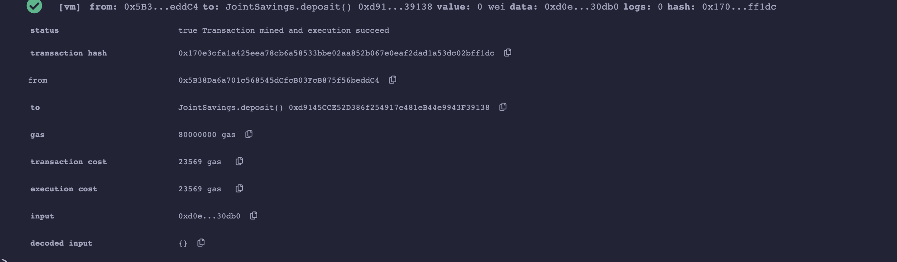
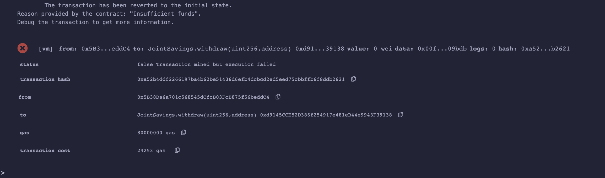
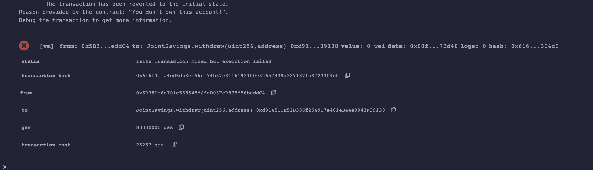

# Joint Savings Accounts - Smart Contracts: Challenge_20

Here we are creating automated joint savings accounts through a Solidity smart contract that accepts two user addresses. These addresses are able to control a joint savings account. The smart contract uses basic ether management functions to implement a financial institution’s requirements for providing the features of the joint savings account. These features consist of the ability to deposit and withdraw funds from the account.

## Running a Deposit Transaction - received a successful outcome. 

## Running a balance check for sufficient funds - Requested a withdrawal request higher than my balance and received an error with of 'Insufficient Funds'

## Running a recipient validation - to make sure the proper accounts are depositing and withdrawing funds. Error message was returned if the validation failed. 

